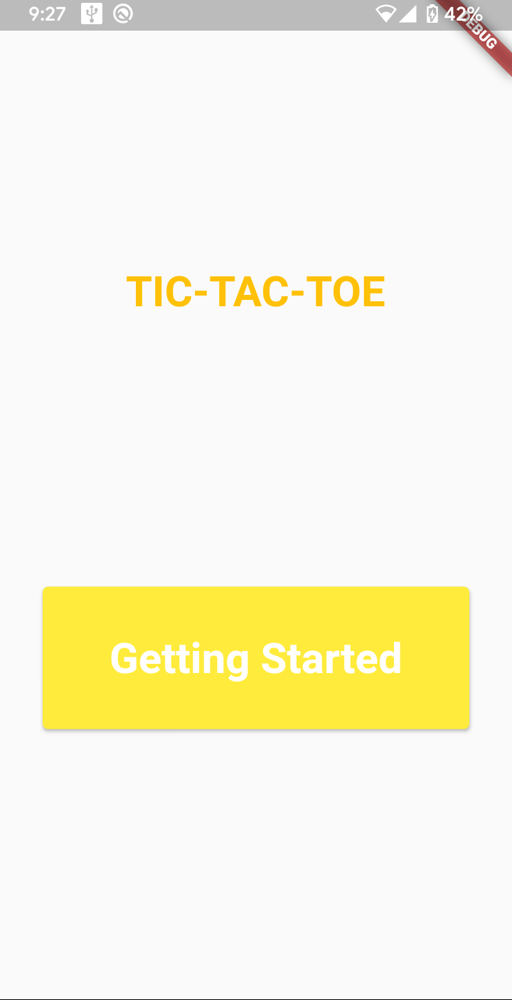
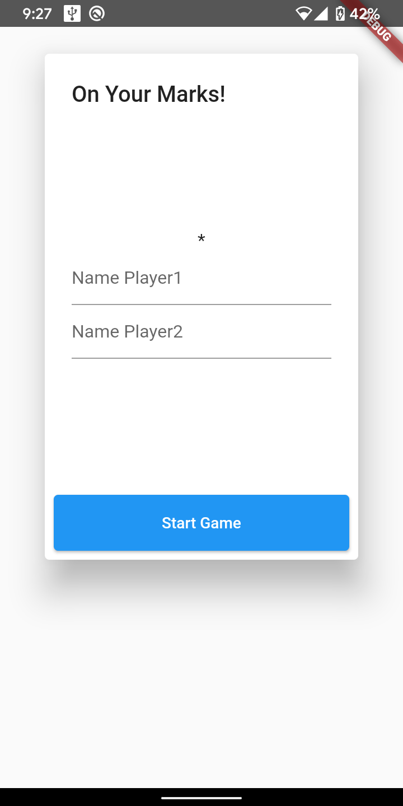
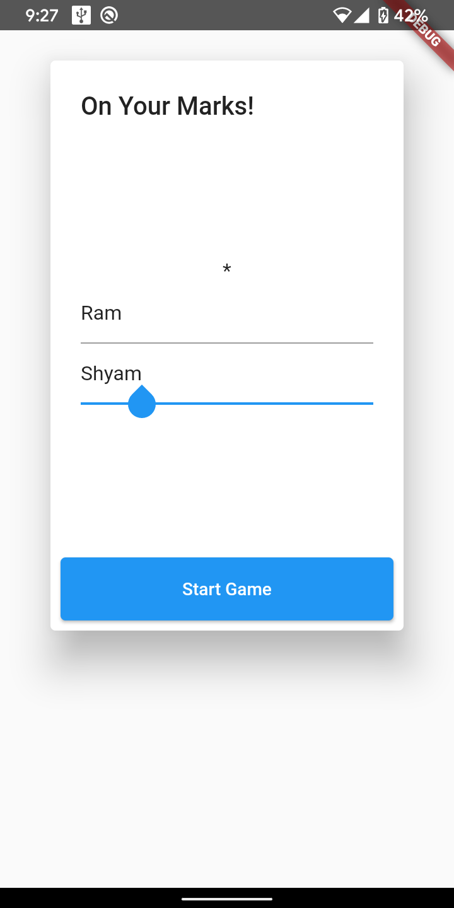
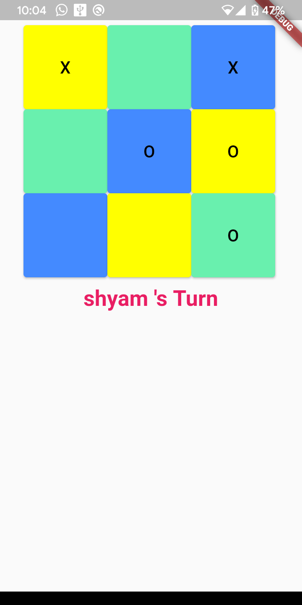
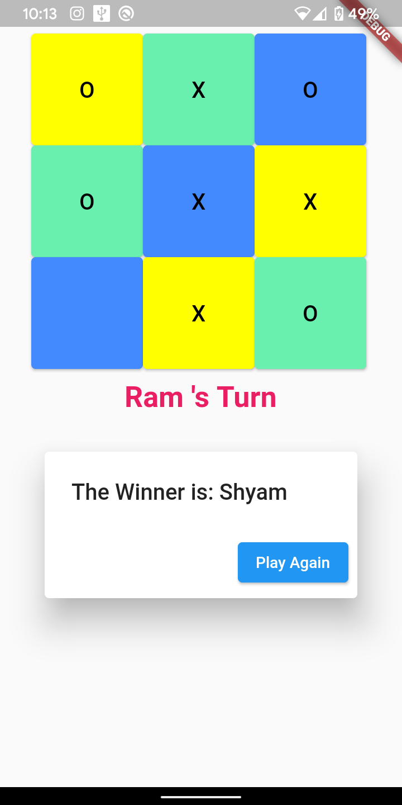

# TIC_TAC_TOE
## A Flutter Game App 
### Created with basic understanding and logic that the player who completes same symbols horizontally, vertically or diagonally before the other user.

   
 
    

